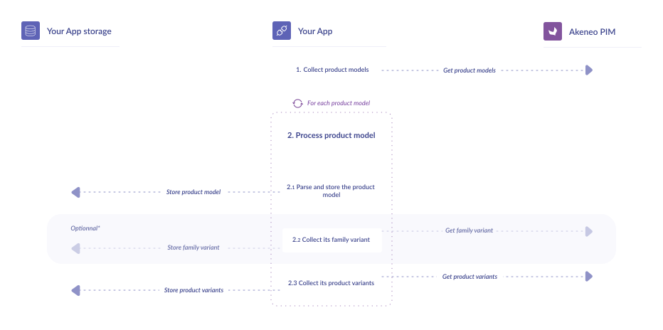

<a href="/tutorials/homepage.html" class="back-button">
   <button>
      
      All guided tutorials
   </button>
</a>

# How to collect product variations

<table class="tag-container">
    <tr>
        <td>Use case:</td>
        <td>
            <div class="tag-not-selectable">
                <div class="tag-color tag-color-light-blue"></div>
                <div class="tag-label">App Workflow</div>
            </div>
        </td>
    </tr>
    <tr>
        <td>PIM Features:</td>
        <td class="td-features">
            <div class="tag-not-selectable">
                <div class="tag-color tag-color-purple"></div>
                <div class="tag-label">Product Models</div>
            </div>
            <div class="tag-not-selectable">
                <div class="tag-color tag-color-light-green"></div>
                <div class="tag-label">Variant Products</div>
            </div>
        </td>
    </tr>
</table>

<div class="endpoint-container">
    <div class="endpoint-text">REST API endpoint(s):</div>
    <a href="/api-reference.html#get_families" class="endpoint-link" target="_blank" rel="noopener noreferrer">family</a>
    <a href="/api-reference.html#Familyvariants" class="endpoint-link" target="_blank" rel="noopener noreferrer">family variants</a>
    <a href="/api-reference.html#Attribute" class="endpoint-link" target="_blank" rel="noopener noreferrer">attributes</a>
</div>

<div class="block-requirements">
    <div class="block-requirements-headline">
        If you're following our App workflow, make sure you previously read:
    </div>
    <div class="block-requirements-row">
        
        <div class="block-requirements-steps">
            <ul>
                <li>Step 1. <a href="how-to-get-your-app-token.html" target="_blank" rel="noopener noreferrer">Get your App token tutorial</a></li>
                <li>Step 2. <a href="how-to-retrieve-pim-structure.html" target="_blank" rel="noopener noreferrer">How to retrieve PIM structure</a></li>
                <li>Step 3. <a href="how-to-get-families-and-attributes.html" target="_blank" rel="noopener noreferrer">How to get families and attributes</a></li>
                <li>Step 4. <a href="how-to-get-product-information.html" target="_blank" rel="noopener noreferrer">How to get product information</a></li>
            </ul>
        </div>
    </div>
</div>

## Context

In the PIM we handle product models and product variations.


Here are quick definitions:

**A product model gathers products with many similarities but a few differences - these differences are called “variations” and are defined by an associated family variant.**

*Example: T-shirts with the same material (”wool”), brand (”a brand”), and weight (”16 grams”); but with different sizes and colors.*

**A product variant is associated with a product model. It contains the common attribute values of its product model plus values for variations.**

*Example: A t-shirt with material = ”whool”, brand = ”a brand”, weight = ”16 grams”, size = “XL”, and color = “blue*”.

And because a relation schema is worth a thousand words:


::: tips
Get the big picture <a href="/getting-started/synchronize-pim-products-6x/step-0.html" target="_blank" rel="noopener noreferrer">here</a>.
:::


## Collect product variations

### Workflow



In this tutorial, we will introduce you to the two use cases you may encounter for retrieving products with variations.

- **Use case 1**: Collect all product variation information, just as they are in the PIM (up to 2 possible levels)
- **Use case 2**: Collect all product variation information on 1 level only)

::: info
We noticed that many e-commerce solutions understand product variation on only one level. This means that for Akeneo a special recollection of the variations must be done to have them all on the same level.
:::

### 0 - Initialization

```php [activate:PHP]

$pimUrl = 'https://url-of-your-pim.com';
$appToken = 'your_app_token'; // Token provided during oAuth steps

// If you haven't done it yet, please follow the Guzzle official documentation for installing the client 
// https://docs.guzzlephp.org/en/stable/overview.html#installation

// Set your client for querying Akeneo API as follows
function getApiClient(): GuzzleHttp\Client
{
    $pimUrl = '<PIM_URL>';
    $appToken = '<APP_TOKEN>'; // Token provided during oauth steps

    return new GuzzleHttp\Client([
        'base_uri' => $pimUrl,
        'headers' => ['Authorization' => 'Bearer ' . $appToken],
    ]);
}

```

### Use case 1: Collect product variation information - all levels

#### 1. Collect product models
##### 1.1 You are following the App workflow?

In the guided tutorial [**"How to get families and attributes"**](/tutorials/how-to-get-families-and-attributes.html), we have stored a family_code_list. It’s time to use it!

```php [activate:PHP]

function getProductModels(): array
{
    $client = getApiClient();

    $maxProductsPerPage = 100;
    $maxFamiliesPerQuery = 3;
    $scope = 'ecommerce';

    // Get family $codes and locales from storage
    $familyCodes = getFamilyCodes();
    $locales = getLocales('fr');

    $familyCodeChunks = array_chunk($familyCodes, $maxFamiliesPerQuery);

    $apiUrl = '/api/rest/v1/product-models?'
        . 'locales=%s'
        . '&scope=%s'
        . '&search={"family":[{"operator":"IN","value":%s}]}'
        . '&limit=' . $maxProductsPerPage;


    // Collect product models from paginated API
    $productModels = [];
    foreach ($familyCodeChunks as $familyCodes) {
        $response = $client->get(sprintf($apiUrl, $locales, $scope, json_encode($familyCodes)));
        $data = json_decode($response->getBody()->getContents(), true);
        $productModels[] = $data['_embedded']['items'];
    }

    $productModels = array_merge(...$productModels);

    saveProductModels($productModels);
}

```

##### 1.2 You are not following the App workflow?
Simply get the attribute type by requesting the API

```php [activate:PHP]

function getProductModels(): array
{
    $client = getApiClient();

    $maxProductsPerPage = 100;
    $scope = 'ecommerce';

    $apiUrl = '/api/rest/v1/product-models?'
        . '&scope=%s'
        . '&limit=' . $maxProductsPerPage;

    // Collect product models from paginated API
    $response = $client->get(sprintf($apiUrl, $scope));
    $data = json_decode($response->getBody()->getContents(), true);

    $productModels = [];
    $productModels[] = $data['_embedded']['items'];
    while (array_key_exists('next', $data['_links'])) {
        $response = $client->get($data['_links']['next']['href']);
        $data = json_decode($response->getBody()->getContents(), true);
        $productModels[] = $data['_embedded']['items'];
    }

    $productModels = array_merge(...$productModels);

    saveProductModels($productModels);
}

```

#### 2. Process product model
##### 2.1. Parse and store the product model
Parse and store a product or a product model is definitely the same thing. Please have a how to our guided tutorial [**"How to get product information"**](/tutorials/how-to-collect-products.html).

##### 2.2. Parse and store the product model
###### 2.2.1 You are following the App workflow?

Good news: you already store the family variant in the guided tutorial [**"How to get families and attributes"**](/tutorials/how-to-get-families-and-attributes.html). Go ahead!

###### 2.2.2 You are not following the App workflow?
Query the API.

```php [activate:PHP]

function getFamilyVariants(): array
{
    $client = getApiClient();

    $maxProductsPerPage = 100;
    $apiUrl = '/api/rest/v1/families/%s/variants?limit=' . $maxProductsPerPage;

    // Get family codes from storage
    $codes = getFamilyCodes();

    // Collect family variants from paginated API
    $variants = [];
    foreach ($codes as $code) {
        $response = $client->get(sprintf($apiUrl, $code));
        $data = json_decode($response->getBody()->getContents(), true);
        $variants[] = $data['_embedded']['items'];
    }

    $variants = array_merge(...$variants);

    // Save variants into storage
    saveVariants($variants);
}

```

##### 2.2. Collect its product variants

To get product variants associated to a product model, ask to the API

```php [activate:PHP]

function getProductsUuid(): array
{
    $client = getApiClient();

    $maxProductsPerPage = 100;
    $maxProductModelsPerQuery = 3;

    $productModelCodesChunks = array_chunk(getProductModelCodes(), $maxProductModelsPerQuery);

    $apiUrl = '/api/rest/v1/products-uuid?'
        . 'search={"parent":[{"operator":"=","value":%s}]}'
        . '&limit=' . $maxProductsPerPage;


    // Collect product models from paginated API
    $productsUuid = [];
    foreach ($productModelCodesChunks as $productModelCodes) {
        $response = $client->get(sprintf($apiUrl, json_encode($productModelCodes)));
        $data = json_decode($response->getBody()->getContents(), true);
        $productsUuid[] = $data['_embedded']['items'];
    }

    $productsUuid =  array_merge(...$productsUuid);
}

```

Again, treat each product like a simple product. Please refer to the guided tutorial [**“How to get product information”**](/tutorials/how-to-collect-products.html) 